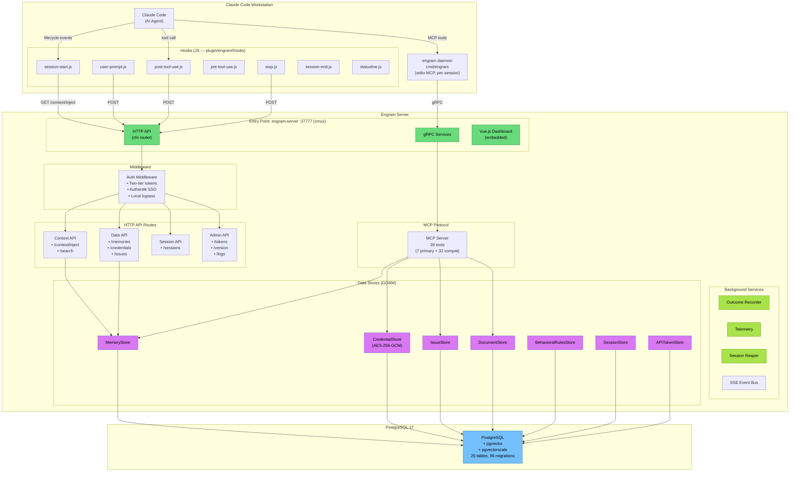

# Engram Architecture

Shared memory infrastructure for Claude Code workstations.
PostgreSQL 17 + pgvector backend, Docker deployment, multi-workstation support.

## System Overview



## Data Flow

### Session Start (Context Injection)

```
Claude Code starts session
  → session-start.js hook fires
    → GET /api/context/inject?project=X&cwd=Y
      → MemoryStore: retrieve always-inject + project-scoped memories
      → Format as <engram-context>...</engram-context>
      → Return to Claude Code (injected into system prompt)
```

### Memory Storage (MCP Tool)

```
Agent calls store_memory / store MCP tool
  → engram daemon receives stdio JSON-RPC
    → gRPC call to engram-server
      → MemoryStore.Create(memory)
        → PostgreSQL INSERT into memories table
        → FTS tsvector auto-updated
```

### Memory Retrieval (MCP Tool)

```
Agent calls recall_memory / recall MCP tool
  → engram daemon receives stdio JSON-RPC
    → gRPC call to engram-server
      → Hybrid search: FTS (tsvector) + optional vector (pgvector)
      → Ranked results returned
```

### Hook Events (Observation Pipeline)

```
Claude Code tool call / user prompt / session end
  → JS hook fires (HTTP POST to server)
    → Server records event in sdk_sessions / memories
    → SSE event broadcast to dashboard
```

## Authentication Flow (v6)

```
Server starts with ENGRAM_AUTH_ADMIN_TOKEN
  → Operator opens dashboard, logs in with admin token
    → Issues worker keycards via /tokens page
      → Each workstation stores its keycard via /engram:setup
        → All MCP + hook traffic uses the worker keycard
          → Server validates token → resolves workstation identity
```

## Deployment

```
Docker (production):
  ghcr.io/thebtf/engram:latest  ← engram-server
  PostgreSQL 17 + pgvector      ← separate container or Unraid app

Plugin (workstations):
  thebtf/engram-marketplace     ← Claude Code plugin marketplace
  engram daemon auto-installed  ← runs per-session as MCP server
```
